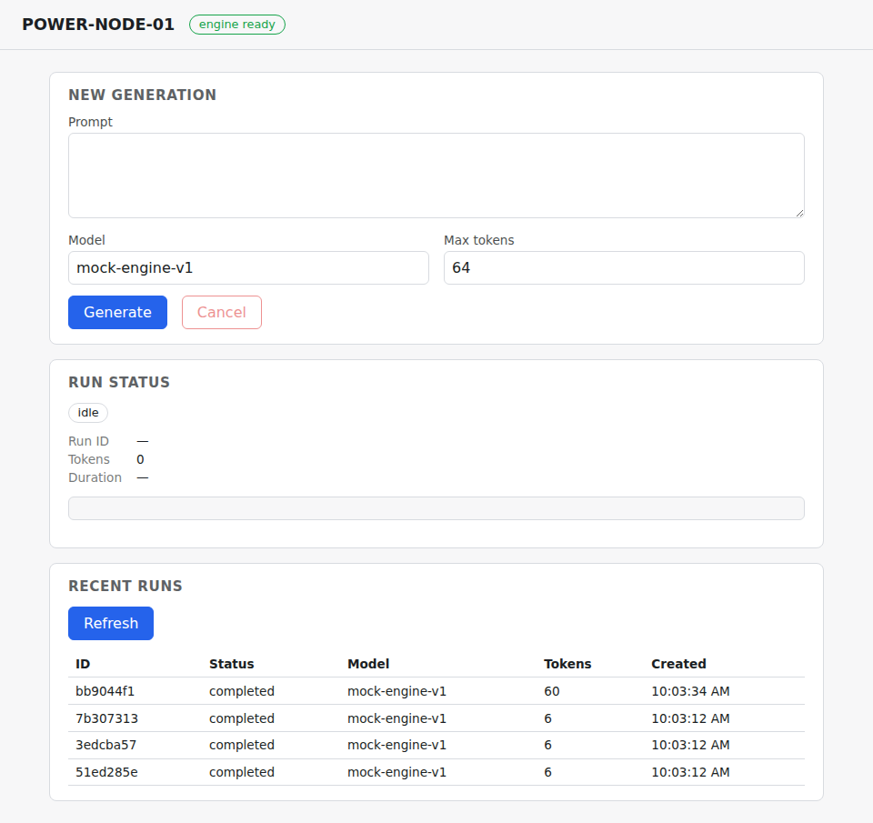
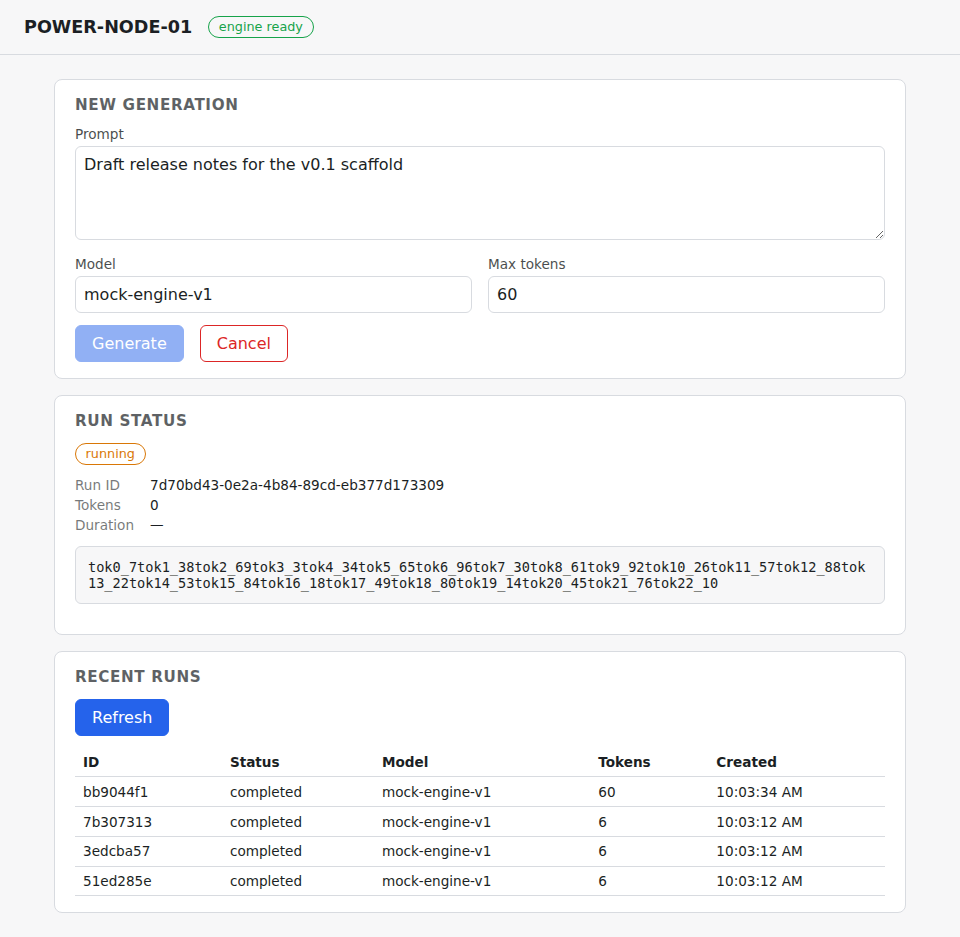
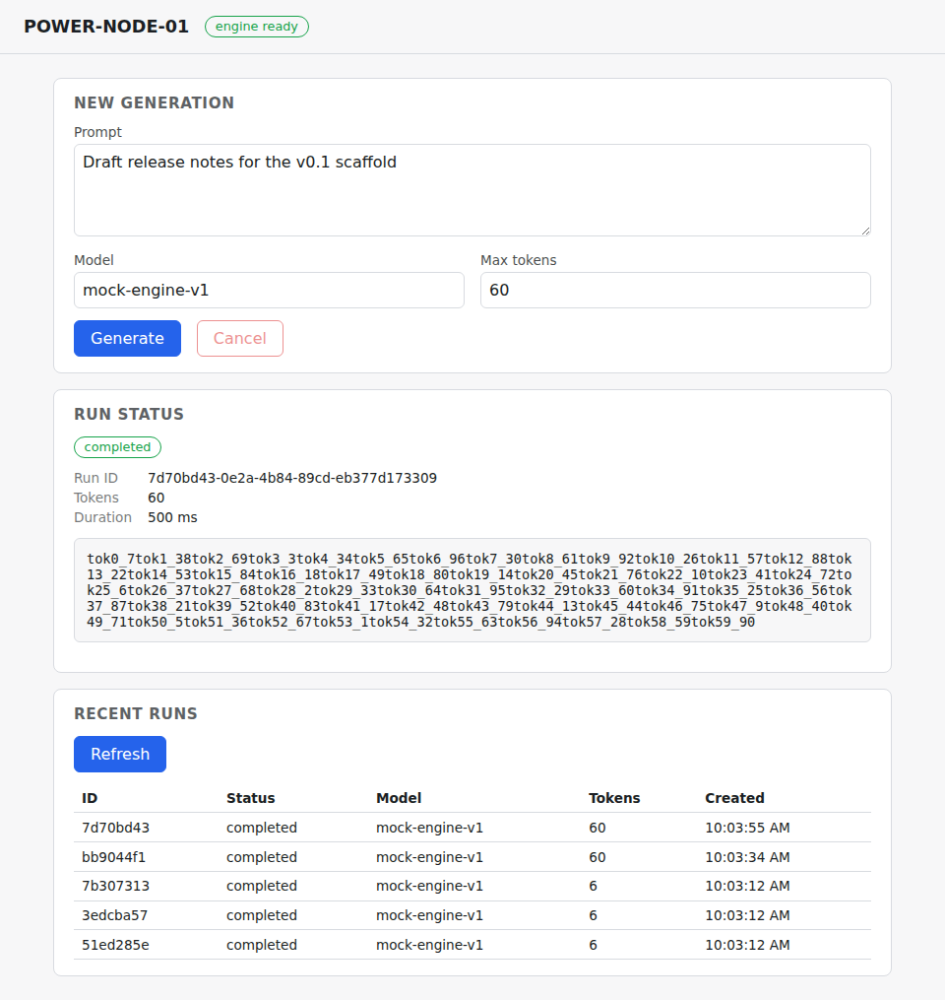
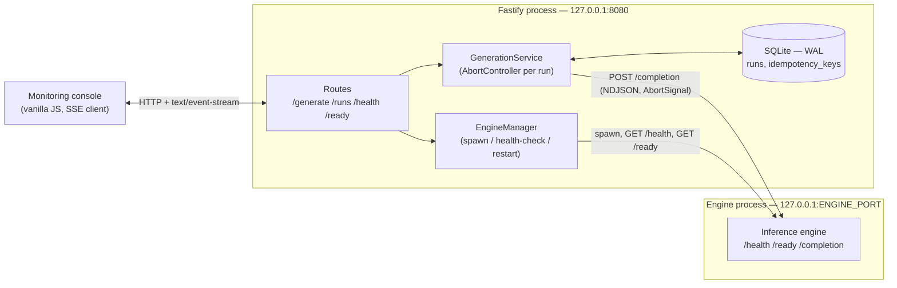
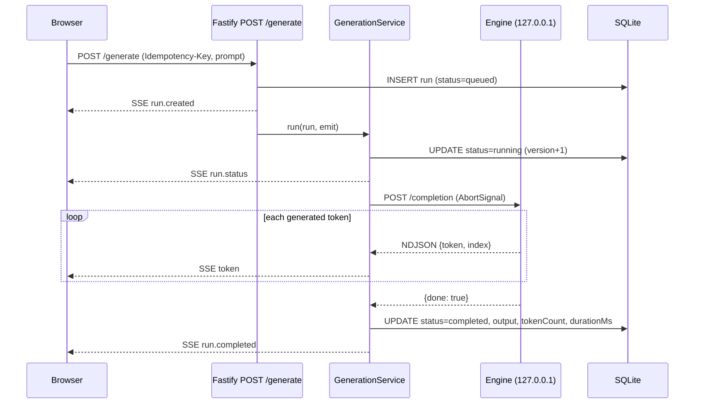
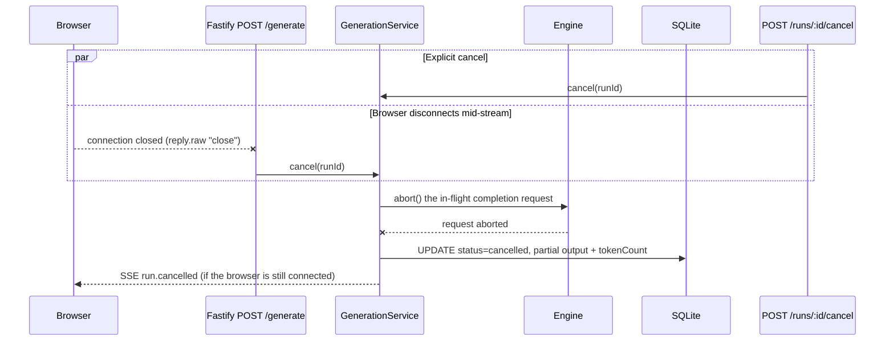

# POWER-NODE-01

[](https://github.com/anatolilavra-droid/ai-node-monitor/actions/workflows/ci.yml)

A local-first inference appliance: a Fastify API in front of a local LLM
engine process, an SSE-streamed vanilla-JS monitoring console, and durable
run history in SQLite. No cloud inference, Docker, Kubernetes, Redis, or
Postgres required.

See [`CLAUDE.md`](CLAUDE.md) for the project's non-negotiables and
conventions, and [`docs/CONTRACT.md`](docs/CONTRACT.md) for the HTTP/SSE
contract.

## Screenshots

The monitoring console is plain, browser-native JS — no framework, no
bundler. Every value shown (status, token count, duration) comes straight
off the run record returned by the API, not a client-side simulation.

| Idle | Streaming | Completed |
|---|---|---|
|  |  |  |

## Architecture

Three independent processes, each with one job: the browser talks only to
Fastify, Fastify talks to SQLite and to the engine, and the engine never
talks to anything but Fastify. The engine binds `127.0.0.1` only and can
crash and restart without taking Fastify down with it.



### Generation lifecycle (happy path)

Every state shown in the console — `queued`, `running`, `completed` — is a
row transition in SQLite guarded by the `version` column (optimistic
concurrency), not just an in-memory flag.



### Cancellation and disconnect reconciliation

A cancel button and a dropped connection are the same event from
`GenerationService`'s point of view: whichever happens first aborts the
one `AbortController` for that run, and the terminal status is always
persisted before the SSE stream closes — a run can never end up stuck
`running` with nothing left watching it.



## Setup

```bash
npm install
cp .env.example .env
npm run migrate
npm run dev      # tsx watch, runs src/server.ts directly
# or
npm run build && npm start
```

The server listens on `127.0.0.1:8080` by default and serves the
monitoring console at `/`. It spawns its own local inference engine
process bound to `127.0.0.1` (see "Engine" below).

## Engine

`src/engine/mockEngineServer.ts` is a deterministic, dependency-free mock
model used for local development: it produces real generated tokens with
real measured timing over a small HTTP contract (`GET /health`,
`GET /ready`, `POST /completion`), but does no actual deep-learning
inference. `src/engine/engineManager.ts` spawns it as an independent OS
process, restarts it with a bounded retry count if it crashes, and exposes
its readiness through `GET /ready`. Swapping in a real engine (e.g.
llama.cpp's server) means implementing the same three-endpoint contract
and pointing `EngineManager` at it — the rest of the system does not need
to change.

## API

- `GET /health` — liveness.
- `GET /ready` — readiness (DB reachable and engine ready).
- `POST /generate` — `Idempotency-Key` header required. Body:
  `{ prompt, model?, maxTokens? }`. Response is `text/event-stream`
  (`run.created`, `run.status`, `token`, `run.completed`, `run.cancelled`,
  `run.failed`).
- `GET /runs` — paginated run history (`?limit=&offset=`).
- `GET /runs/:id` — a single run.
- `POST /runs/:id/cancel` — `Idempotency-Key` header required; cancels an
  in-flight generation.

Full request/response and SSE event shapes: [`docs/CONTRACT.md`](docs/CONTRACT.md).

## Testing

```bash
npm run typecheck
npm run lint
npm test               # unit tests
npm run test:integration  # migrations + SSE lifecycle (create, stream, cancel, disconnect)
```

Integration tests run against a real temporary SQLite database built from
the actual migrations in `db/migrations/`, and against the real mock
engine process (not a stub) so cancellation and disconnect behavior is
exercised end to end.

## CI

[`.github/workflows/ci.yml`](.github/workflows/ci.yml) runs the same gate
on every push/PR to `main`: `typecheck` → `lint` → `migrate` → `test` →
`test:integration` → `build`, then uploads `dist/`, `public/`, and the
migrations as a build artifact. There is no live deploy target yet
(non-negotiable: "deployment is a native OS service first") — the
artifact is what you'd copy onto a host and run with `node dist/server.js`
behind a process supervisor (systemd, pm2, etc.).

## Known limitations (v0.1 scaffold)

- The inference engine is a deterministic mock, not a real model runtime.
- Idempotent replay of `POST /generate` returns the run's current stored
  state as a single snapshot; it does not re-attach a second connection to
  a still-streaming generation.
- No authentication/authorization — single-tenant appliance.
- No model manifest loading/validation yet (non-negotiable #12 covers this
  once real model loading exists).
- Engine port is fixed (`ENGINE_START_PORT`), not scanned for availability.

## Project structure

```
.github/workflows/  CI pipeline (typecheck, lint, test, build)
db/migrations/       immutable SQL schema migrations
docs/                API/SSE contract, screenshots
src/config/          env loading and validation (Zod)
src/db/              SQLite connection + migration runner
src/domain/          shared types
src/schemas/         Zod request schemas
src/repositories/    prepared-statement SQL access
src/engine/          engine process manager, HTTP client, mock engine
src/services/        generation lifecycle, serializers
src/routes/          Fastify route handlers
public/              vanilla-JS monitoring console (no bundler)
tests/unit/          fast, no I/O
tests/integration/   real SQLite + real engine process
```
