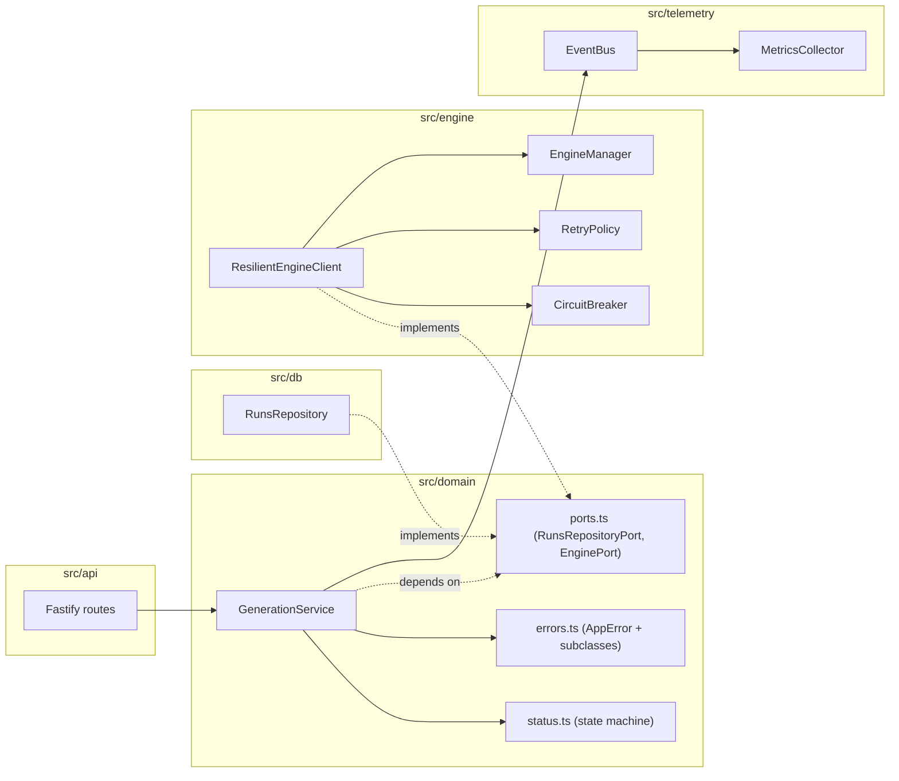
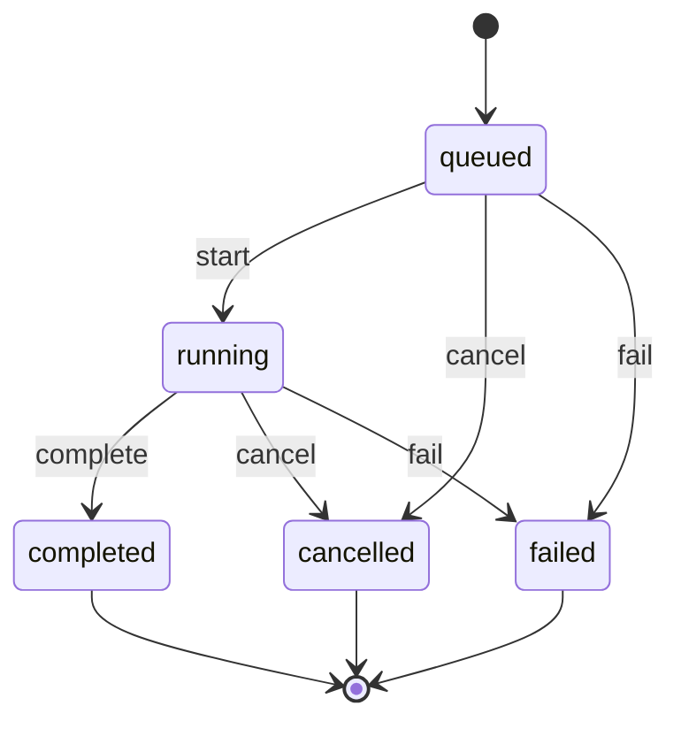
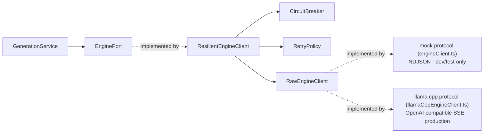
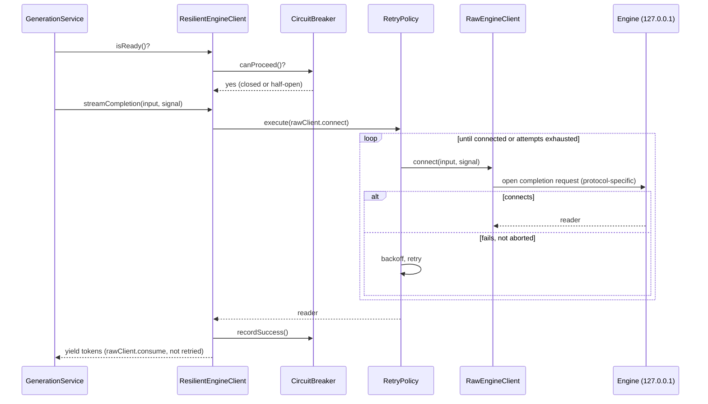

# Architecture

This document describes the internal structure of the Fastify process:
how responsibilities are layered, how the engine is called resiliently,
and how the process's lifecycle is managed. The public HTTP/SSE contract
is unaffected by any of this - see [`CONTRACT.md`](CONTRACT.md) for that;
this document is about how the contract is *implemented*.

## Layering

```
src/api/        Fastify routes: parse + validate input, call the domain
                service, map the result (or a thrown domain error) to an
                HTTP/SSE response. No business logic lives here.

src/domain/     Business logic. Depends only on the ports it defines
                (RunsRepositoryPort, EnginePort) - never on Fastify types
                or raw SQL. GenerationService, the run state machine
                (status.ts), and the structured error types (errors.ts)
                live here.

src/db/         SQLite. RunsRepository is the only place that writes SQL,
                and it implements RunsRepositoryPort so the domain layer
                can depend on the interface instead of this class.
                connection.ts and migrate.ts own the schema lifecycle.

src/engine/     Everything about talking to the local inference engine:
                process lifecycle (EngineManager, mode-aware - spawns a
                child process in dev/test, only health-polls a real
                llama.cpp server in production), two protocol-specific
                RawEngineClient implementations (engineClient.ts's mock
                NDJSON, llamaCppEngineClient.ts's OpenAI-compatible SSE),
                and the resilience layer (CircuitBreaker, RetryPolicy,
                ResilientEngineClient) that implements EnginePort for the
                domain layer on top of whichever RawEngineClient is
                configured.

src/telemetry/  A small typed event bus and a MetricsCollector that
                subscribes to it. Nothing above this layer needs to know
                whether anything is listening.

src/config/     Zod-validated environment configuration. Fails closed:
                loadConfig() throws on any invalid or missing value.

src/app.ts      Wires every layer together (buildApp) and owns the
                process lifecycle (AppState: start/stop/getState).
```

Dependency direction is one-way: `api -> domain -> {db, engine, telemetry}
-> config`. `domain` never imports from `api`, `db`, or the Fastify/
better-sqlite3 packages directly - only from the `*Port` interfaces it
declares in `domain/ports.ts`. That is what makes `GenerationService`
unit-testable against in-memory fakes (see
`tests/unit/domain/generation-service.test.ts`) instead of requiring a
real SQLite file and a real engine process for every test.



## The run state machine (`domain/status.ts`)

Every status change a run can undergo is one of four events, and
`nextStatus(current, event)` is the single source of truth for which
transitions are legal:



`GenerationService` calls `nextStatus` instead of hardcoding status
string literals at each call site; an illegal transition throws
`ConflictError` rather than silently writing a nonsensical status. This
is enforced independently of `RunsRepository.transitionStatus`'s
optimistic-concurrency check (the `version` column) - the state machine
is a business rule, the version check is a persistence race guard, and
they answer different questions ("is this transition allowed at all" vs.
"did someone else already move this row").

## Structured errors

`domain/errors.ts` defines `AppError` and four subclasses
(`ValidationError` 400, `NotFoundError` 404, `ConflictError` 409,
`EngineUnavailableError` 503), each carrying a stable `code` used
verbatim as the `error` field in HTTP responses. The central Fastify
error handler in `app.ts` checks `isAppError(err)` and maps
`statusCode`/`code`/`message` directly, replacing the previous ad-hoc
`'statusCode' in err` duck-typing. `ZodError` (thrown by every route's
`.parse()` calls) is still handled as a special case first, since it
isn't a domain error and its `issues` array needs its own formatting -
this preserves the exact `VALIDATION_FAILED` shape the contract already
documents.

`NotFoundError` takes its `code` as a constructor argument rather than
hardcoding one, so `GET /runs/:id` and `POST /runs/:id/cancel` can keep
returning the contract's documented `RUN_NOT_FOUND` code without a
resource-specific subclass.

## Engine resilience

`ResilientEngineClient` (the `EnginePort` implementation `GenerationService`
actually uses) does not know how to speak to any specific engine - it
takes a `RawEngineClient` (`engine/rawEngineClient.ts`) as a constructor
dependency and wraps whichever one is configured with identical
circuit-breaker/retry/cancellation logic:



`ENGINE_MODE` (config) selects which `RawEngineClient` `buildApp` wires
into `ResilientEngineClient` (`selectRawEngineClient` in `app.ts`); no
other code changes between modes.



Two rules keep this safe, enforced in `ResilientEngineClient` regardless
of which `RawEngineClient` is behind it:

1. **Only the connection attempt is retried.** Once a raw client's
   `consume()` has started yielding tokens from a reader, a failure is
   never retried - retrying after partial output would duplicate tokens
   the caller has already seen. Both `engineClient.ts` (mock) and
   `llamaCppEngineClient.ts` (production) split their own `connect`
   (retryable) from `consume` (not) for exactly this reason.
2. **A cancellation is never a circuit-breaker failure.** `isAbortError`
   checks `err.name === 'AbortError'` and short-circuits both the retry
   policy's `isRetryable` and `ResilientEngineClient.recordOutcome` -
   otherwise, every user-initiated cancel would count against the same
   failure budget as a genuinely broken engine, and enough cancellations
   would trip the breaker for everyone.

`GET /ready` intentionally still reports `EngineManager.isReady()` (raw
process/health liveness), not the circuit breaker's state: a
liveness/readiness probe answering "is the engine process itself up" is a
different question from "should we currently attempt a generation," and
conflating them would make an operator's health check flap on transient
generation failures that the circuit breaker is specifically designed to
absorb quietly. `GET /internal/health` (an operational endpoint, not part
of the stable contract in `CONTRACT.md` - see `docs/MONITORING.md`) does
expose the circuit breaker's state (`ResilientEngineClient.getCircuitState()`)
for diagnostics.

`EngineManager` itself has two modes selected by the same `ENGINE_MODE`:
in `'mock'` it spawns and restarts a child process (dev/test, unchanged
from before); in `'llama-cpp'` it never spawns or kills anything - the
engine is a real llama.cpp server supervised by its own systemd unit
(`deploy/systemd/llama-cpp.service.example`) - and instead polls
`GET /health` on an interval (`ENGINE_HEALTH_POLL_INTERVAL_MS`) to notice
if it becomes unhealthy or recovers, since an externally-managed
process's crash/restart produces no signal this one would otherwise see.

## Telemetry

`telemetry/EventBus` is a minimal typed publish/subscribe bus (see
`telemetry/events.ts` for the full `AppEventMap`). `GenerationService`
publishes each lifecycle transition (`run.created`, `run.status`,
`run.completed`, `run.cancelled`, `run.failed`) and `ResilientEngineClient`
publishes `engine.circuit` on every state change. Payloads carry only
`runId`, `status`, `tokenCount`, and (for failures) `errorMessage` - never
`prompt` or `output`, per non-negotiable #7.

`MetricsCollector` is the one subscriber today: `buildApp` constructs
exactly one per process and decorates the Fastify instance with it
(`app.metrics`, typed via Fastify module augmentation in `app.ts`) so
both `AppState.getState()` and the `GET /internal/health` route
(`api/internalHealth.ts`, `telemetry/healthCheck.ts`) can read the same
snapshot. This is deliberately not the stable `CONTRACT.md` surface -
`/internal/health`'s shape can grow without a contract version bump (see
`docs/MONITORING.md`).

## Process lifecycle (`AppState`)

```
created --start()--> starting --> running --stop()--> stopping --> stopped
```

`buildApp(deps)` (unchanged signature) builds and wires the Fastify
instance but does not call `.listen()` or start the engine - that keeps
it usable by the integration test harness, which wants a bare
`FastifyInstance` to listen on an OS-assigned port. `AppState` wraps
`buildApp` for the production entrypoint (`server.ts`): `start()` starts
the engine then Fastify; `stop()` is idempotent and closes Fastify, stops
the engine, and closes the database handle in that order, however
shutdown was triggered. `getState()` returns a snapshot (`lifecycle`,
`dbOpen` via better-sqlite3's own `.open` flag, `engineReady`, and the
metrics snapshot) for structured shutdown logging.

## What the CONTRACT.md contract guarantees stays stable

- Every route, status code, and SSE event name documented in
  `CONTRACT.md` is unchanged by production-readiness work (real engine
  support, the optional auth gate, `/internal/health`) - additive only.
- The `public/` monitoring console (unauthenticated by design - see
  `docs/SECURITY.md` on why enabling `API_AUTH_ENABLED` doesn't change
  that without a reverse-proxy workaround).
- The `runs` and `idempotency_keys` schema and `db/migrations/`.
- The mock engine's own dev/test HTTP contract
  (`GET /health`, `GET /ready`, `POST /completion`).

`GET /internal/health` and the optional `Authorization: Bearer` gate on
`/generate`/`/runs*` (`API_AUTH_ENABLED`) are both new, additive surface
introduced for production deployments - see `docs/MONITORING.md` and
`docs/SECURITY.md` respectively. Neither is part of `CONTRACT.md`.
